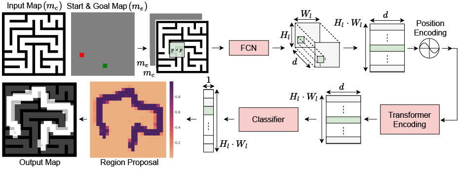

# Motion Planning Transformers: One Model to Plan them All
The network architecture for Motion Planning Transformers (MPT).



### Requirements
All our experiments were conducted on `Ubuntu18.04` with `Python3.6` with `CUDA11.0`. To generate the data, and evaluate the planner you will need the [OMPL-1.4.2](https://ompl.kavrakilab.org/index.html) library with the Python bindings.

Other python dependencies are given in `requirements.txt`. You can install the package using pip:

```
pip3 install -r requirments.txt
```

#### Using Docker

We highly recommend that to replicate our testing environment, users can use our docker container which contains all the necessary libraries packages. Please use the latest version of [nvidia-docker2](https://github.com/NVIDIA/nvidia-docker). Download the `.tar` [file](https://drive.google.com/file/d/154E338PduQPHfO0sUqA8ZST1GaQodY41/view?usp=sharing).

To load the image from the `tar` file, run the following:

```
docker load -i mpt_container.tar
```

To run the container, run the following command:

```
docker run -it --gpus all --shm-size="16G" -v ~/global_planner_data:/root/data bash
```

You can run the script in `docker/ompl_torch_docker.sh`. Attach the folder containing the data to `/root/data` and the folder with the code to `/workspace`.

### Creating Dataset
To generate training or validation data set for the point environment you can run the following command:

```
python3 rrt_star_map.py --start=... --numEnv=... --envType=... --numPaths=... --fileDir=... --mapFile
```

To collect data samples for the car environment you can run the following command:

```
python3 sst_map.py --start=... --numEnv=... --numPaths=... --fileDir=...
```

You can download all the data we used for training from [here](https://drive.google.com/drive/folders/1uP_l_pLLljRv6sn5xlcCkq3iTiuKHdDA?usp=sharing).

### Training

To train the data, run the following command:

```
python3 train.py --batchSize=... --mazeDir=... --forestDir=... --fileDir=...
```

### Pre-trained Models
You can download the pretrained models for the point robot and Dubins Car Model from [here](https://drive.google.com/file/d/1kd-n9NyybQueJbL1ud4Bf6PhK99gLhkT/view?usp=sharing) and [here](). We have included models at multiple epochs, all our results use the model at the 69th epoch.

### Evaluation

To evaluate a set of validation paths, you can run the following code:

```
python3 eval_model.py --modelFolder=... --valDataFolder=... --start=... --numEnv=... --epoch=... --numPaths=...
```


### Results

<table>
	<thead>
	<tr>
		<th>Environment </th>
		<th colspan="3">Random Forest</th>
		<th colspan="3">Maze</th>
	</tr>
	</thead>
	<tbody>
		<tr>
			<td></td>
			<td>Accuracy</td>
			<td>Time (sec)</td>
			<td>Vertices</td>
			<td>Accuracy</td>
			<td>Time (sec)</td>
			<td>Vertices</td>
		</tr>
		<tr>
			<td>RRT*</td>
			<td>99.88%</td>
			<td>5.44</td>
			<td>3227.5</td>
			<td>100%</td>
			<td>5.36</td>
			<td>2042</td>
		</tr>
		<tr>
			<td>IRRT*</td>
			<td>99.88%</td>
			<td>0.42</td>
			<td>267</td>
			<td>100%</td>
			<td>3.13</td>
			<td>1393.5</td>
		</tr>
		<tr>
			<td>MPT-RRT*</td>
			<td>97.68%</td>
			<td>0.20</td>
			<td>251</td>
			<td>98.96%</td>
			<td>0.83</td>
			<td>615</td>
		</tr>
		<tr>
			<td>MPT-IRRT*</td>
			<td>97.68%</td>
			<td>0.07</td>
			<td>133</td>
			<td>98.96%</td>
			<td>0.74</td>
			<td>557</td>
		</tr>
	</tbody>
</table>


### Visualizing Trajectories
To visualize trajectories, you can use the `VisualizeTrajectories.ipynb` notebook to view the paths. To spin up the jupyter notebook, you can run the following command inside the container environment.

```
export JUPYTER_TOKEN=mpt
jupyter notebook --allow-root --no-browser --ip=0.0.0.0. --port=8888
```

When prompted for a token enter `mpt`.

### Contributing

This code base is currently for reviewing purpose alone. Please do not distribute.